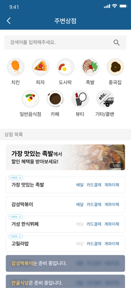

상점 조회 API 요청을 최적화해봅시다.

{/* truncate */}

# 서론

클라이언트의 요구사항이 왔다.

문제 상황은 다음과 같다.

위 화면에서 카테고리를 클릭할 때 상점 목록이 나온다.

이때 상점 목록을 출력하기 위해 `현재 운영중인가`에 대한 정보를 서버에서 계산해서 보내준다.

위와 같은 상황에 의해 카테고리를 클릭할 때 마다 상정 목록을 요청하는 API를 호출하게 되는 것이다.

